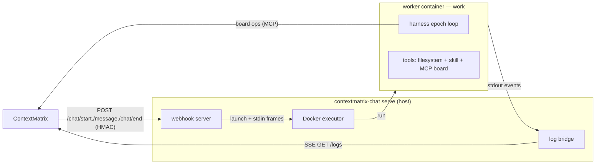

# ContextMatrix Chat

> [!WARNING]
>
> This project is under heavy development. Breaking changes should be expected
> at the current stage.

`contextmatrix-chat` is the **chat backend** for ContextMatrix: a Go service
that runs interactive AI chat sessions in isolated Docker containers, bridges
the board's MCP tools into each session, and streams the conversation back to
ContextMatrix over Server-Sent Events. It reuses the shared
[`contextmatrix-harness`](https://github.com/mhersson/contextmatrix-harness) for
the interactive loop — in-context compaction, seeded-history resume, and live
turns. It targets operators running ContextMatrix who want model-flexible,
board-aware chat.

## How it fits ContextMatrix

ContextMatrix splits its execution backends:

- **TaskBackend** — card execution (`contextmatrix-runner` or
  `contextmatrix-agent`).
- **ChatBackend** — interactive chat sessions (this service).

The chat backend is selected and configured operator-side and coexists with
whichever task backend is active. It talks to ContextMatrix over three channels:

- **Chat lifecycle webhooks** (CM → chat) — HMAC-signed `POST /chat/start`,
  `POST /message`, `POST /chat/end`.
- **Log stream** (chat → CM) — Server-Sent Events at `GET /logs?session_id=…`.
- **Board operations** (worker → CM, over **MCP**) — the in-session model reads
  and writes cards through ContextMatrix's MCP endpoint.

The model and the per-session MCP key are chosen by ContextMatrix and arrive in
the chat-start payload — the chat backend does not select models.

## Architecture



`serve` owns the container lifecycle: it hosts the lifecycle webhooks, launches
one worker per session, applies resource caps, stages and refreshes secrets,
fans container logs to SSE subscribers, and drains on `SIGTERM` (stop accepting
work, shut down HTTP, kill tracked containers). `work` runs the inner loop
inside the container: it assembles the tool registry (filesystem/shell tools
rooted at `/workspace`, an optional skill tool, and the board's MCP tools),
seeds history when resuming, and drives the interactive epoch loop. The loop,
LLM client, tools, redaction, and event stream live in the standalone
`contextmatrix-harness` module — FSM-free and free of any `contextmatrix-*`
dependency.

## Requirements

- Go 1.26+ to build.
- Docker on the host running `serve` (it launches worker containers).
- A reachable ContextMatrix instance (REST API + MCP endpoint). A multi-user
  ContextMatrix (the default) provisions the per-session model, MCP API key,
  LLM endpoint, and git credentials in the chat-start payload — git
  credentials are then fetched fresh per repo, per operation, from CM's worker
  git-credentials endpoint, not staged upfront.
- A shared HMAC secret (at least 32 characters), configured on both this service
  and ContextMatrix.
- Only against a pre-multi-user ContextMatrix: an LLM endpoint API key
  (OpenRouter by default, or any OpenAI-compatible endpoint) and GitHub
  authentication (a GitHub App or a fine-grained PAT) configured locally — see
  "Local credential fallback" in `serve.yaml.example`.

## Running as a ContextMatrix backend

1. **Build the worker image.**

   ```bash
   make docker-worker           # tags contextmatrix-chat-worker:dev (full)
   make docker-worker-variants  # go-node / python / rust variants
   ```

   The default (`full`) image carries the baseline CLIs (`git`, `gh`, `rg`,
   `fd`, `node`) plus the **Go, Python, and Rust** toolchains — Go with
   `golangci-lint`/`gofumpt`, Python via `uv`/`uvx` (a managed CPython) with
   `ty`/`ruff`, and Rust via `rustup`/`cargo` with `clippy`/`rustfmt`. Slimmer
   single-language variants (`go-node`, `python`, `rust`) are also published.
   Toolchain versions are pinned and SHA256-verified.

   The default (`full`) image covers Go, Node, Python, and Rust; **any other
   ecosystem needs an image carrying that toolchain** — build one `FROM` a
   published variant (see the agent repo's `docs/custom-images.md` pattern). A
   per-project image override lands separately.

   For a real deployment, publish a digest-pinned image and reference it from
   `base_image`.

2. **Write the service config.**

   ```bash
   mkdir -p ~/.config/contextmatrix-chat
   cp serve.yaml.example ~/.config/contextmatrix-chat/serve.yaml
   # set: contextmatrix_url, container_contextmatrix_url, api_key,
   #      base_image, chat_run_dir
   ```

   A multi-user ContextMatrix provisions git credentials and the LLM endpoint
   per session, so the local `github.*` and `llm_endpoint.*` blocks are
   optional — they are the deprecated fallback for pre-multi-user servers (see
   the "Local credential fallback" section in `serve.yaml.example`).

   Every field also has a `CMX_*` override (see `serve.yaml.example`).
   `container_contextmatrix_url` is the ContextMatrix URL as seen from inside
   containers — without it, workers point at their own localhost and fail at MCP
   connect. For a Docker bridge network this is typically
   `http://172.17.0.1:8080`.

3. **Run the service.**

   ```bash
   ./contextmatrix-chat serve            # listens on :9093
   ```

   It reads `--config` (default `~/.config/contextmatrix-chat/serve.yaml`) and
   validates the merged config at startup.

4. **Point ContextMatrix at it.** Configure ContextMatrix's chat backend to send
   lifecycle webhooks to this service's URL, signing them with the shared
   `api_key`. The ContextMatrix-side configuration lives in the ContextMatrix
   repo.

### Service management

For an unattended deployment, run chat as a systemd **user** service instead of
the foreground `serve` command:

```bash
make build                    # build the contextmatrix-chat binary
./svc.sh install              # write + enable ~/.config/systemd/user/contextmatrix-chat.service
./svc.sh start                # start it (also: stop / status / print / verify / uninstall)
```

The generated unit is sandboxed (read-only home, restricted syscalls, resource
caps) and runs `serve --config ${XDG_CONFIG_HOME:-~/.config}/contextmatrix-chat/serve.yaml`.
`svc.sh` reads `chat_run_dir` from that config and whitelists it for writing.

`redeploy.sh` updates a running install in place — rebuild the binary and worker
image, pin the new image digest into `serve.yaml`, and restart the service:

```bash
./redeploy.sh
```

> **Writable runtime dirs.** Chat writes secrets under `secrets_dir` (default
> `/var/run/cm-chat/secrets`) and per-session state under `chat_run_dir`.
> `/var/run` is root-owned and not created for a user service — either pre-create
> `/var/run/cm-chat` and `chown` it to your user, or set these to paths under your
> home (e.g. `~/.cm-chat/secrets`, `~/.cm-chat/runs`); the unit whitelists both
> trees plus the configured `chat_run_dir`.

## Commands

| Command | Purpose                                                                              |
| ------- | ------------------------------------------------------------------------------------ |
| `serve` | Run the chat backend: host ContextMatrix chat sessions and launch worker containers. |
| `work`  | Container entrypoint (hidden): run one interactive chat session.                     |

## Configuration

Configuration is layered: defaults < config file < environment. The file
defaults to `~/.config/contextmatrix-chat/serve.yaml` (the XDG config path).
Every field has a `CMX_*` environment override; nested keys use a double
underscore (`CMX_GITHUB__AUTH_MODE`, `CMX_COMPACTION__THRESHOLD`).
`serve.yaml.example` documents every field, its default, and its env override.

Required fields: `contextmatrix_url`, `api_key` (≥ 32 chars), `base_image`,
`chat_run_dir`. The `llm_endpoint` and `github` blocks are optional — a
multi-user ContextMatrix (the default) provisions the LLM endpoint and git
credentials per session; set either block only as the deprecated fallback for
a pre-multi-user CM (see "Local credential fallback" in
`serve.yaml.example`). When `llm_endpoint.type` is `openai`,
`llm_endpoint.base_url` is required; when `github.auth_mode` is set, the
matching credentials for that mode (`app` or `pat`) are required.

Task-skills need no chat config: serve fetches a git pointer from ContextMatrix,
clones it on the host, and mounts it read-only into each worker at
`/run/cm-skills`. CM is the single source of truth.

## Development

```bash
make build          # go build ./... + the binary
make test           # go test ./...
make test-race      # CGO_ENABLED=1 go test -race ./...
make lint           # golangci-lint run
make fmt            # gofumpt -w .
make docker-worker  # build the worker image
```

CI gates on `go test`, `go test -race`, `golangci-lint`, `go build`,
`govulncheck`, a Dockerfile `hadolint` pass, and a Trivy scan of the worker
image. Conventions, package boundaries, and commit discipline live in
[AGENTS.md](AGENTS.md).

## Further reading

- [AGENTS.md](AGENTS.md) — orientation for contributors and agents.
- [serve.yaml.example](serve.yaml.example) — every service config field,
  documented.
- [ContextMatrix](https://github.com/mhersson/contextmatrix) — the control plane.

## License

MIT — see [LICENSE](LICENSE).
